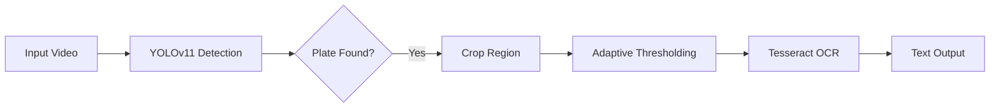

<div align="center">

# 🚘 Vision-Based License Plate Recognition (ALPR)
### End-to-End Detection & OCR System

[](https://cse.buffalo.edu/~sreyasee/CSE574/projects.html)
[](https://docs.ultralytics.com/models/yolo11/)


*A high-performance ALPR system featured on the University Projects Portal for its robust handling of real-world constraints.*

[View Code](alpr.py) • [Read the Report](A%20Vision-Based%20Approach%20for%20License%20Plate%20Text%20Recognition.pdf)

</div>

---

## 🏆 Project Recognition
**This project was selected as a Featured Project by the University at Buffalo Department of Computer Science.** It was recognized for its comprehensive error analysis and the successful integration of deep learning detection with legacy OCR systems.

---

## 📖 Overview
Automatic License Plate Recognition (ALPR) in uncontrolled environments remains a challenge due to motion blur, oblique angles, and variable lighting. 

This project implements a two-stage pipeline:
1.  **Detection:** A custom-trained **YOLOv11** model to localize plates.
2.  **Recognition:** An image processing pipeline feeding into **Tesseract OCR** for text extraction.

We benchmarked state-of-the-art models (YOLOv11 vs. YOLOv12), finding that **YOLOv11** offered superior stability and accuracy for small, high-density targets like license plates.


## 🏗️ Architecture




## 📊 Performance Benchmarks

We evaluated the system on a diverse dataset of **800+ images** (post-augmentation) covering Indian, European, and North American formats.

| Feature | YOLOv11 (Selected) | YOLOv12 |
| :--- | :--- | :--- |
| **mAP @ 0.5** | **0.87** | Lower Stability |
| **F1-Score** | **0.88** | 0.84 |
| **Detection Accuracy** | **89%** | 86% |
| **Convergence** | 📈 **Fast & Stable** | 📉 Fluctuating |

> **Analysis:** YOLOv11 demonstrated better separation of license plates from background noise compared to YOLOv12, which had a higher false positive rate (14%).

---

## 🛠️ Technical Challenges & Solutions

### 🔴 Challenge: Skewed Perspectives & Noise
Standard OCR engines like Tesseract struggled significantly when plates were viewed at oblique angles or contained motion blur, leading to diminished efficacy.

### 🟢 Solution: Augmentation & Hybrid OCR
We implemented a rigorous **data augmentation pipeline** (Perspective Warping, Gaussian Blur, Rotation $\pm15^{\circ}$) to simulate these conditions during training. Additionally, we validated results using a **CRNN (Convolutional Recurrent Neural Network)** to handle sequence modeling for distorted text.

```python
# Augmentation Logic Snippet
def augment_plate(image):
    # Simulate camera jitter and perspective tilt
    image = apply_gaussian_blur(image, sigma=1.5)
    image = random_perspective_warp(image, distortion_scale=0.2)
    return image
```

## 💻 Tech Stack

| Component | Technology | Role |
| :--- | :--- | :--- |
| **Detection** | `Ultralytics YOLOv11` | Real-time localization of plates |
| **Vision** | `OpenCV (cv2)` | Adaptive Thresholding, Contours |
| **OCR** | `Tesseract v4.1 / CRNN` | Character sequence recognition |
| **Language** | `Python 3.9` | Pipeline orchestration |

---

### 🔗 Links
- [📄 **Read the Full Technical Report**](A%20Vision-Based%20Approach%20for%20License%20Plate%20Text%20Recognition.pdf)
- [💻 **View Source Code**](alpr.py)

---
*University at Buffalo | Deep Learning (CSE 676-B)*
