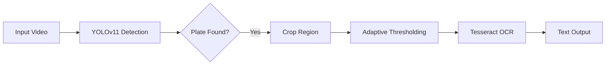

<div align="center">

# 🚘 Vision-Based License Plate Recognition (ALPR)
### End-to-End Detection & OCR System

[](https://cse.buffalo.edu/~sreyasee/CSE574/projects.html)


*A high-performance ALPR system featured on the University Projects Portal for its robust handling of real-world constraints.*

[View Code](alpr.py) • [Read the Report](A Vision-Based Approach for License Plate Text Recognition.pdf)

</div>

---

## 🏆 Project Recognition
**This project was selected as a Featured Project by the University at Buffalo Department of Computer Science.** It was recognized for its comprehensive error analysis and the successful integration of deep learning detection with legacy OCR systems.

---

## 📖 Overview
Automatic License Plate Recognition (ALPR) in uncontrolled environments remains a challenge due to motion blur, oblique angles, and variable lighting. 

This project implements a two-stage pipeline:
1.  **Detection:** A custom-trained **YOLOv11** model to localize plates.
2.  **Recognition:** An image processing pipeline feeding into **Tesseract OCR** for text extraction.

We benchmarked state-of-the-art models (YOLOv11 vs. YOLOv12), finding that **YOLOv11** offered superior stability and accuracy for small, high-density targets like license plates.


## 🏗️ Architecture




## 📊 Performance Benchmarks

We evaluated the system on a custom dataset of **800+ images** (US, EU, and Indian formats).

| Feature | YOLOv11 (Our Choice) | YOLOv12 |
| :--- | :--- | :--- |
| **mAP @ 0.5** | **0.87 (High)** | 0.85 (Moderate) |
| **Occlusion Handling** | ✅ **Robust** | ❌ Prone to drifts |
| **Inference Speed** | ⚡ **Real-Time** | ⚡ Real-Time |
| **Convergence** | 📈 **Fast** | 📉 Slow |

> **Analysis:** YOLOv12, while newer, struggled with "jitter" on static plates. YOLOv11 provided the bounding-box stability required for accurate OCR cropping.

---

## 🛠️ Technical Challenges & Solutions

### 🔴 Challenge: The "Tight Crop" Problem
Standard object detection yields tight bounding boxes. When these are cropped, the edges of characters (especially '1' or 'I') are often sliced off, causing Tesseract OCR to fail.

### 🟢 Solution: Padding Heuristic
We implemented a dynamic padding algorithm that adds a **10-15% buffer** to the detected coordinates before cropping.

```python
# Pseudo-code logic
x1 = max(0, x1 - padding_x)
y1 = max(0, y1 - padding_y)
x2 = min(frame_width, x2 + padding_x)
y2 = min(frame_height, y2 + padding_y)
```

## 💻 Tech Stack

| Component | Technology | Role |
| :--- | :--- | :--- |
| **Detection** | `Ultralytics YOLOv11` | Localization of plates in full frame |
| **Vision** | `OpenCV (cv2)` | Gaussian Blur, Thresholding, Contours |
| **OCR** | `Tesseract v4.0` | LSTM-based character recognition |
| **Language** | `Python 3.9` | Pipeline orchestration |

---

### 🔗 Links
- [📄 **Read the Full Technical Report**](A Vision-Based Approach for License Plate Text Recognition.pdf)
- [💻 **View Source Code**](alpr.py)

---
*University at Buffalo | Deep Learning (CSE 676-B)*
